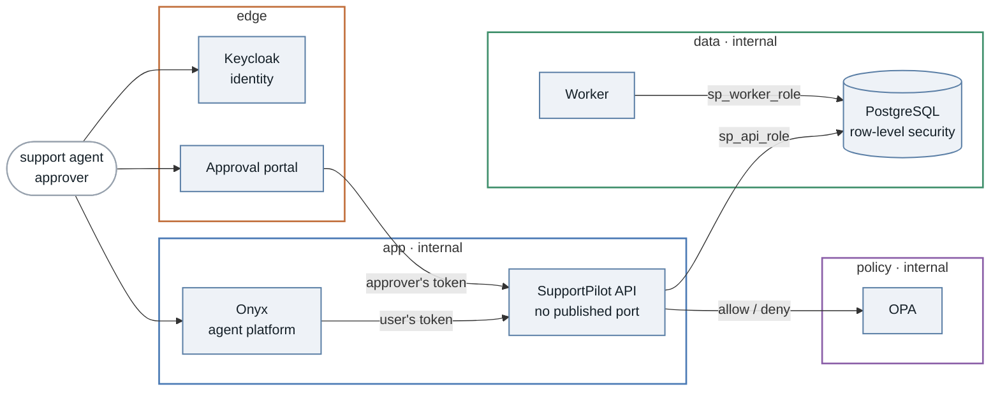
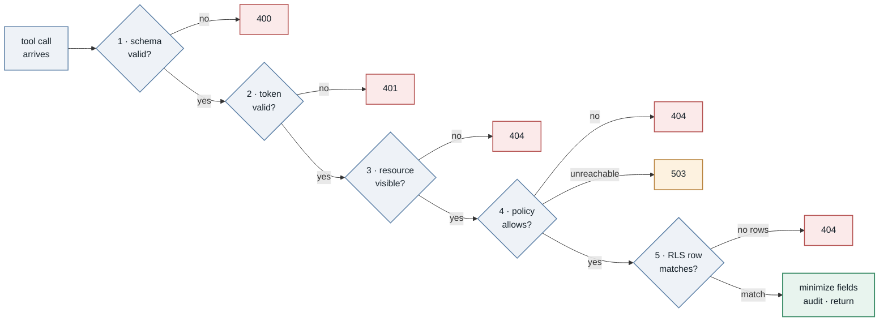
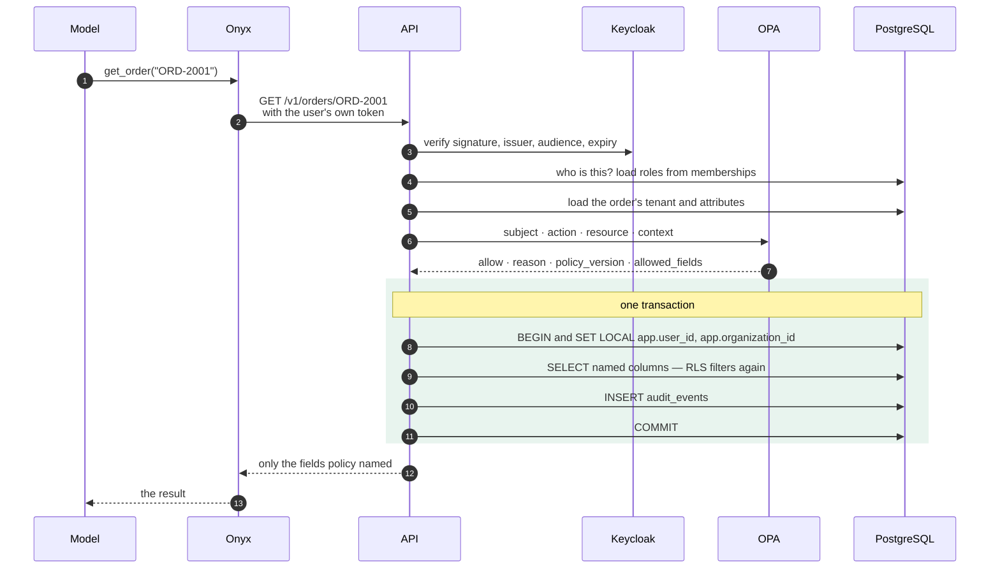
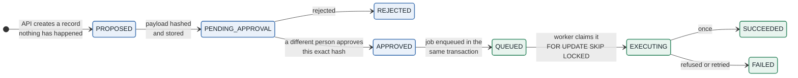
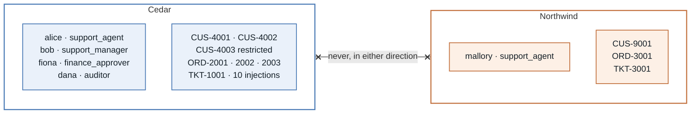

# SupportPilot — Architecture

A multi-tenant AI support agent, built so that every control can be removed and the resulting
failure observed.

> **The core rule:** the model may *propose* tool use. Trusted services decide what is allowed, and
> trusted services perform every real action.

Everything below follows from that one sentence.

---

## The documents

| File | Covers |
|---|---|
| this one | components, networks, the request pipeline, the layers that say no |
| [the-range.md](the-range.md) | The Range — the practice surface, and the boundaries on the one service that can break the others |

---

## The shape of the system

Eight components on six networks. The networks are the first control: most of the isolation here is
enforced by the fact that two containers simply cannot reach each other.

The Range adds a ninth, profile-gated and deliberately fenced off; it has its own document above
because it is the service most worth reviewing. Two more come up under the same profile and exist
only to bound it: the `probe`, which makes the API requests the Range cannot, and the `docker-proxy`,
which is the only way it can restart a container.

Now read the arrows that are **not** there, because they are the design:

| Missing arrow | Why it matters |
|---|---|
| Onyx to PostgreSQL | The agent platform holds no database credential at all |
| Approval portal to PostgreSQL | A portal that could reach the database could edit an approved payload |
| Approval portal to OPA | The portal enforces nothing; it renders and forwards |
| Worker to OPA | The worker decides nothing; it re-verifies facts already recorded |
| Worker to the API | Execution is not reachable from the request path |
| Anything to OPA but the API | The policy network has exactly one consumer |

That last column is not prose. It is a test: `V-02` in the verification script reads
*postgres and opa unreachable from the approval portal.*

The API has **no published port**. You cannot curl it from your laptop, which is deliberate: every
request must arrive the way a real one does. A one-shot `migrate` container (not drawn) applies the
schema as `sp_migrator_role` and exits before the API starts.

### Who is who

| Component | Connects as | Networks | What it must never do |
|---|---|---|---|
| **Onyx** | — | `app` | Touch the database, or decide authorization |
| **The model** | — | — | Hold a credential, approve anything, execute anything |
| **Keycloak** | — | `edge`, `app` | — |
| **API** | `sp_api_role` | `app`, `policy`, `data` | Perform a protected financial effect in the request path |
| **OPA** | — | `policy` | Query business data, or enforce anything |
| **PostgreSQL** | — | `data` | Accept a connection from Onyx or the public network |
| **Approval portal** | no credential | `edge`, `app` | Modify a payload after approval |
| **Worker** | `sp_worker_role` | `data` | Read business data, or take instructions from a model |

---

## What actually decides

A tool call passes through five independent checks. Any one can say **no**. None can say
*"yes, skip the rest."*

Three things to take from that picture.

**Every refusal looks the same from outside.** Cross-tenant, non-existent, policy-denied and
RLS-filtered all return `404`. A caller cannot use the status code to learn that a record exists.

**A policy outage is `503`, not `404`.** If OPA is unreachable, malformed, timed out, or returns a
non-boolean `allow`, the answer is deny — and the caller is told it is an outage, because pretending
the record does not exist would be a lie that hides a broken control. There is no cached allow and no
local fallback. Stop OPA and try it.

**Identity never comes from the request.** The tenant comes from the token; the roles come from the
database. No tool takes a `user_id`, `organization_id`, `role` or `approved` parameter — those fields
do not exist in any schema, and adding one returns `400` rather than being silently dropped.

### Reading an order, step by step

Step 8 is the one worth staring at. The tenant context is **transaction-local**, so a pooled
connection cannot carry one user's identity into the next user's query. `V-12` checks exactly that:
*context-free read still returned 0 rows after 12 pooled requests.*

Steps 9 and 10 are in the same transaction on purpose. If the audit write fails, the read fails.
Evidence written after the commit is evidence that goes missing in precisely the case you will be
asked about.

---

## Two layers, always

Tenant isolation is enforced twice, by two systems that share no code.

| | Layer 1 · policy (OPA) | Layer 2 · row-level security |
|---|---|---|
| Asks | is the subject a member of the resource's tenant? does their role permit this action? which fields may come back? | `organization_id = app.current_org()` |
| Runs in | a separate process on a private network | the database, on every statement |
| Fails closed by | deny on unreachable, malformed or undefined | unset context, so `NULL`, so zero rows |

`FORCE` is the detail that makes layer 2 real. PostgreSQL exempts a table's **owner** from its own
row policies unless `FORCE` is set — so an application connecting as the role that ran the migrations
gets no filtering at all, while the policies sit in the schema looking perfectly correct. Here the
migration role owns everything and the runtime roles own nothing.

When the two layers disagree, that is an event. If policy allows a read and RLS returns no rows, the
API writes `order.read.rls_empty` to the audit trail before returning `404`. A disagreement between
your two controls should be loud.

### The five database roles

| Role | Holds | Never holds |
|---|---|---|
| `sp_migrator_role` | ownership of schema `app`, all DDL | a credential inside any running service |
| `sp_api_role` | `SELECT` on named tables, `INSERT` on notes, actions, audit | ownership, `BYPASSRLS`, `SUPERUSER`, DDL |
| `sp_worker_role` | job claim, execution state, audit `INSERT` | any grant on customers, orders, tickets, notes |
| `sp_auditor_role` | `SELECT` on `audit_events` | any write, anywhere |
| `sp_range_role` | `USAGE` on schema `range`, `EXECUTE` on the reviewed `range.*` functions | ownership, `BYPASSRLS`, `SUPERUSER`, any privilege on an `app` table |

`sp_range_role` exists in every database — migration `0010` is not conditional — but nothing connects
as it unless the `range` compose profile is up.

The worker **refuses to start** if it can read a customer. Not a warning — a failed boot.

`audit_events` is append-only by grant: no runtime role holds `UPDATE` or `DELETE` on it, so nothing
in the request path can revise its own history.

---

## Irreversible actions

For anything that moves money, the control is not a stricter check. It is **structure**: the request
path can propose, and only the worker can execute.

**Blue** is as far as the API can drive an action. **Green** is worker-only, and that boundary is a
row policy in the database, not a convention in the code. The model has a tool that reaches
`PROPOSED`. It has no tool that approves and no tool that executes. That is the whole control; the
rest is detail.

Before executing anything, the worker independently re-establishes six facts:

1. it holds an exclusive lease on the job
2. the action is in a state that permits execution
3. an approval decision exists, and it is an approval
4. the approver is not the requester
5. the approval has not expired
6. `sha256(payload)` still matches the stored hash **and** the approved hash

Separation of duty is enforced in three unrelated places — the policy, a database trigger, and the
worker. The payload hash is checked in three places too. A control enforced once is a control one bug
away from being absent.

**Executing exactly once** is three cooperating pieces: an idempotency key derived from the action id
and the payload hash, a row reserved *before* the provider is called, and a `UNIQUE` constraint on
that key. If the worker dies mid-call the reservation already exists, so on restart it asks the
provider what happened instead of retrying blind. A timeout is never treated as a failure.

---

## The tools the model can reach

Seven. That is the entire attack surface.

| Tool | Reads | Effect |
|---|---|---|
| `search_customers` | names, capped at 25 by policy | — |
| `get_customer` | one customer | — |
| `get_order` | one order, optionally items and shipment | — |
| `get_ticket` | ticket and messages — untrusted content | — |
| `get_action_status` | lifecycle state only | — |
| `add_internal_note` | — | writes a note, author taken from the token |
| `propose_refund` | — | creates a record; **moves no money** |

No SQL tool. No shell tool. No file tool. No unrestricted HTTP tool. And no parameter typed `object`
without a schema, which is the most common way a business-named tool turns out to be a generic one.

Note what `propose_refund` does *not* take: no identity, no approval flag, and no payout destination.
The destination is derived server-side at execution time, so the model cannot choose where money goes
even in the request it is fully permitted to make.

---

## The test data

Two tenants that must never see each other.

Three fixtures carry most of the lessons:

- **`ORD-3001`** belongs to Northwind. Alice must never read it, however she asks, and whatever a
  ticket tells the agent to do.
- **`CUS-4003`** is marked `restricted`. An agent gets the record without `email`; a manager gets it
  with. The address is not hidden from the agent — it never reaches the agent, because policy
  returned a field list and the API dropped the rest before building the response.
- **`TKT-1001`** carries nine injection attempts written to look like ordinary customer messages:
  instruction overrides, a forged system notice claiming administrator status, a request for the
  system prompt and the connection string, calls to tools that do not exist, and a fabricated tool
  result carrying an approval.

---

## Proving it works

Nothing here is trusted because it was designed carefully. Each control has a check that fails loudly
when it stops working.

| Suite | What it proves | How to run |
|---|---|---|
| `verify_local.py` | 21 environment checks, `V-01` to `V-21` | `python scripts/verify_local.py` |
| `abuse_suite.py` | injection and abuse cases, `TS7-nn` | `python scripts/abuse_suite.py` |
| `action_suite.py` | approval and execution cases, `TS8-nn` | `python scripts/action_suite.py` |
| `contract_suite.py` | every call built from the published tool document | `python scripts/contract_suite.py` |
| policy tests | the Rego rules, including every deny arm | `opa test policy/` |
| API tests | token, policy client, pipeline, hashing, pagination | `pytest services/api` |

`contract_suite.py` exists because of a real failure. One tool declared an array query parameter,
Onyx serialised it one way, the API expected another, and a perfectly correct model request came back
as an error — while 219 tests passed throughout, because every one of them built its own URL.

> **A test that constructs the request is testing your assumptions, not your system.**

---

## Where to start breaking it

The fastest way to understand a control is to remove it and watch what happens. Roughly in order of
how much each one teaches:

1. **Stop OPA**, then read an order you are fully entitled to read. You should get `503` and no data.
   If you get the order, something has a fallback.
2. **Point the API at the migration role** instead of `sp_api_role`. The row policies are still
   there, still correct, and now filtering nothing.
3. **Drop `FORCE`** from one table's row-level security and read across tenants.
4. **Ask the agent for fifteen customer searches** in one message. Every call will be authenticated,
   authorised, correctly tenant-scoped and correctly logged — and you will have the directory.
5. **Approve a refund, then change the amount** in the database before the worker claims it. The hash
   check should refuse it twice over.
6. **Give the agent a service-account token** instead of the user's own. Then ask, as Alice, for
   `ORD-3001`.

The last one changes a single header value and changes everything.

---

## Further reading

- [`../../LAB.md`](../../LAB.md) — install the lab and run it
- [`../../README.md`](../../README.md) — the article this system was built to support
- [`../../specs/`](../../specs/) — the exact contracts: database schema, API, policy
